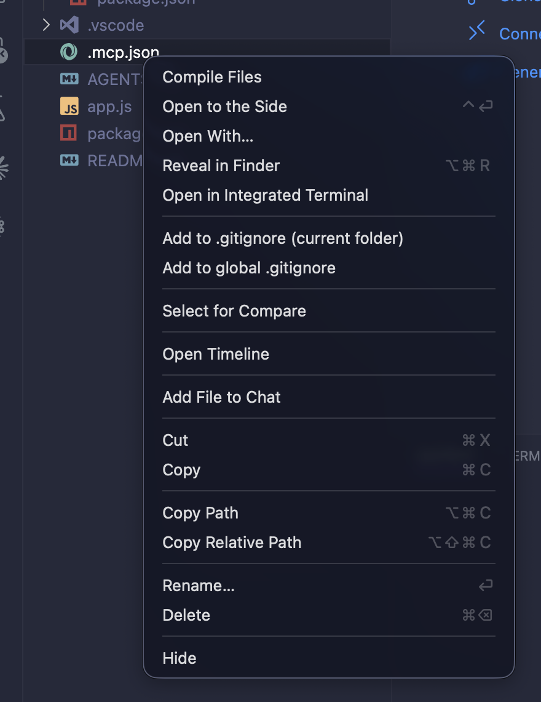

<table border="0" cellpadding="0" cellspacing="0"><tr>
<td width="112"></td>
<td><h1>Quick Ignore for VS Code</h1>Right-click any file or folder in the Explorer to add it to <code>.gitignore</code> — next to the file, or at the root of your workspace.</td>
</tr></table>

## Features

- **Context menu actions** — two options on every right-click in the Explorer: add to local or global `.gitignore`
- **Local `.gitignore`** — writes to a `.gitignore` in the same folder as the selected item (creates it if it doesn't exist)
- **Global `.gitignore`** — writes to the `.gitignore` at the root of your workspace folder (creates it if it doesn't exist)
- **Smart patterns** — anchored patterns (`/path/to/item`) so only the item you clicked is ignored; folders get a trailing slash (`/dirname/`)
- **Duplicate protection** — won't add a pattern that already exists in the file
- **Instant feedback** — opens the resulting `.gitignore` file in the editor after writing so you can review or edit

## Screenshots

Right-click any file or folder in the Explorer and choose either:

| Option | What it does |
| --- | --- |
| **Quick Ignore: Add to local .gitignore** | Appends a pattern to a `.gitignore` in the same folder as the selected item. Creates the file if it doesn't exist. |
| **Quick Ignore: Add to global .gitignore** | Appends a pattern to the `.gitignore` at your workspace root. Creates the file if it doesn't exist. |



## Usage

1. Install the extension from the VS Code Marketplace
2. Right-click any file or folder in the Explorer sidebar
3. Choose **Add to local .gitignore** or **Add to global .gitignore**
4. The pattern is appended and the `.gitignore` file opens for review

That's it — no configuration needed.

## Requirements

- VS Code **1.104** or newer

## Commands

| Command | Title |
| --- | --- |
| `quickIgnore.addToLocalGitignore` | Quick Ignore: Add to local .gitignore |
| `quickIgnore.addToGlobalGitignore` | Quick Ignore: Add to global .gitignore |

Both commands are available in the Explorer context menu for any file or folder.

## How patterns work

Patterns are anchored with a leading `/` so they match only the item you clicked, not same-named files elsewhere in the tree.

- **Local** — the pattern is the item's name relative to its own folder (e.g., `/output.js`, `/build/`)
- **Global** — the pattern is the item's path relative to the workspace root (e.g., `/src/build/output.js`)
- **Folders** — get a trailing slash (e.g., `/dist/`) so the directory and its contents are ignored

## Development

```bash
npm install
npm run compile      # one-shot bundle to dist/extension.js
npm run watch        # incremental rebuild
npm run package:vsix # produce a .vsix to install locally
```

Press `F5` in VS Code to launch an Extension Development Host with the extension active.

## License

MIT
